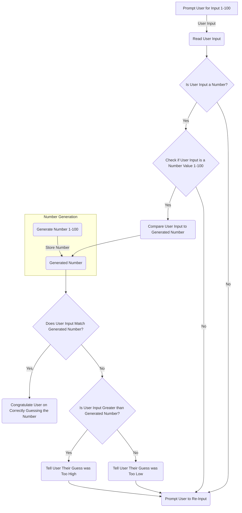

### **_Random Number Guessing Game_**
This is a simple number guessing game where the computer will generate a number between **1 and 100**, and the user will attempt to guess the number. 

#### Process and Edge Cases
The computer will need to follow a process of checks to see if the number that is inputted by the user matches or is higher or lower than the randomly generated number.  

While the initial process is simple, the computer will need to check for edge cases based on user input, such as confirming that the user actually input a number, as well as confirming that the user input a number within the specified range.

#### **Layout**
The layout for the game is simple:
* The computer will prompt the user to enter a number between 1 and 100
* The user inputs their number
* The computer will generate and store a random number within the 1 to 100 range
* The computer will read the user input and perform a few checks
  * Is the user input a number?
  * Is the user input a number within the range of 1 to 100?
* If either check evaluates to false then the computer will prompt the user to re-input
* If both checks are true the computer will then check the user input against the generated number it previously stored
* If the user inputted number matches the stored generated number the computer notifies the user that they correctly guessed the number
* If the number does not match, the computer will perform additional checks
  * Is the user input higher than the generated number?
  * Is the user input lower than the generated number?
* If one of these checks are true the computer will notify the user that their guess was either too high or too low respectively

